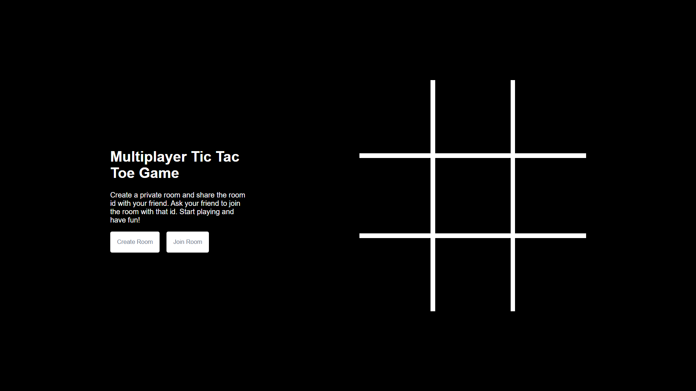

# Multiplayer Tic Tac Toe Game

React Tic Tac Toe Game. Play it here: https://tictac.now.sh

[](https://tictac.now.sh)

### Developing Locally

```bash
# Clone the repo
git clone https://github.com/nfuad/tictac.git
# Move into the cloned repo
cd tictac
# Install the dependencies
npm install
# Start the dev server
npm run dev
```

Navigate to [localhost:3000](http://localhost:3000). You should see the app running.

### License

MIT
